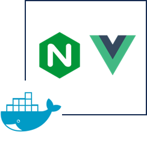
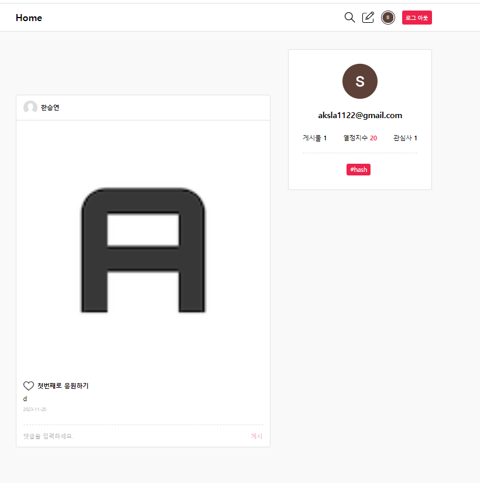
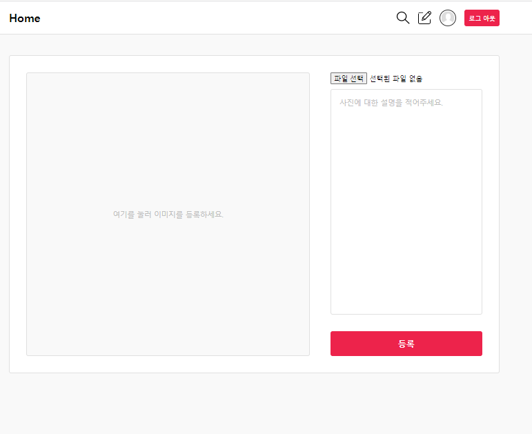
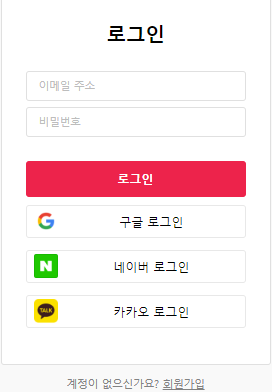
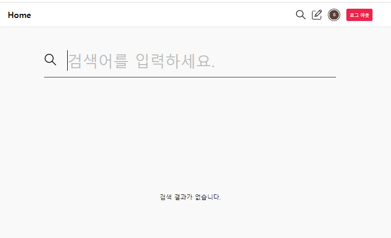

# 프로젝트 개요

- 간단한 Post 등록/수정/삭제, 댓글, 좋아요, SNS 간단 로그인 기능이 있는 간단한 SNS front-end 프로젝트
- veu js 공부를 위해 만들던 clone 코딩하던 소스를 API 연동, jwt 로그인, Oath2 소셜 로그인, Pagination 개선, 포스트, 회원, 수정/삭제, Profile, 도커 빌드 기타 기능 개선 등등 기능을 완성
  시킨 프로젝트

## 기술 스택

- vue js
- vuex

### 시스템 구조



## 화면구성

1. 메인 화면

   

2. 글 작성

   

3. 로그인

   

4. 검색

   

## **프로젝트 실행 방법**

<aside>
💡 Front-end 소스를 실행 전  Back-end repo 에서 미리 소스를 Clone 받아 서버를 실행 시켜 놓는다.

</aside>

Back-end repo 주소

[https://github.com/hanseungyeoun/simple-sms-back-end](https://github.com/hanseungyeoun/simple-sms-back-end)

### env 파일 작성하기

Project 루트 폴더에 각 local, production에 env 파일를 (.env.local, env.production) 생성한다.

| environment             | description                                    |
| ----------------------- | ---------------------------------------------- |
| NODE_ENV                | node로 빌드시 local, 도커로 빌드 시 production |
| VUE_APP_PROXY_SERVER    | 서버 url                                       |
| VUE_APP_API_SERVER_PORT | 서버 포트                                      |
| VUE_APP_FRONTEND_PORT   | node로 빌드시 3000, 도커로 빌드 시 80          |

예시)

```bash
NODE_ENV = "local" #node로 빌드시 local, 도커로 빌드 시 production
VUE_APP_PROXY_SERVER = [서버 url]
VUE_APP_API_SERVER_URL = http://localhost:8080
VUE_APP_API_SERVER_PORT = [서버 포트]
VUE_APP_FRONTEND_PORT = 3000 #node로 빌드시 3000, 도커로 빌드 시 80
```

### Node 빌드 (env.local)

```bash
	## Project setup
	yarn install

	### Compiles and hot-reloads for development
	yarn serve

	### Compiles and minifies for production
	yarn build
```

### 도커 빌드 (env.production)

```bash
	docker build . -t simple-sms-fron-end
	docker run -d -p 80:80 docker run -d -p 80:80 my-app
```
